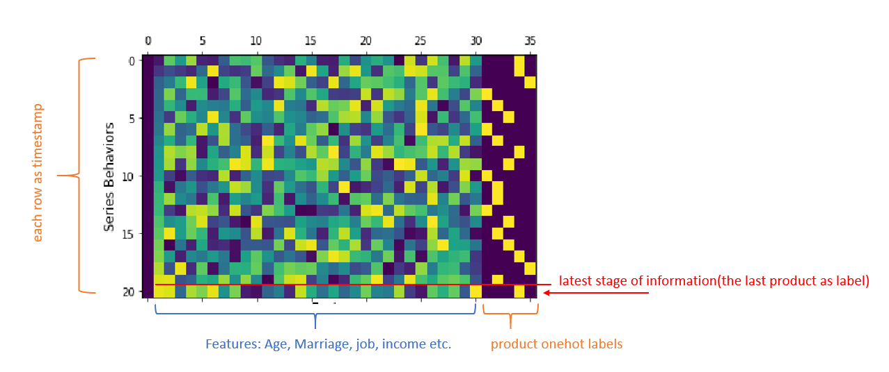

### 1. Introduction: Recommendation System based on RNN and CNN
- This is a jupyter notebook to show idea and instructions of how to build up a simple recommendation system based on series user customers behaviour using RNN and and CNN.
- Scenario (RNN)： We have customers' past behaviors data and what products they bought previously. The past information and products they bought can be treated as series data. For one customer, he or she can have several rows of data beacause previously he or she bought several products with corresponding past information, like age, marriage status, family size etc. we can use lstm a time series deep learning model to learn the customer bahaviors pattern to find which product they will buy next according to their previous behavior. This deep learning model so can be used as recommendation system. The latest product they bought is treated as a training lable, the previous information like age, marriage status, number of children and the products they already bought,ared used features for each time stage. The picture below represents the customer bebehavior.

- Scenario (CNN): As we know,CNN is a kind of deep learning model is to extract the regional features of images, with high-performance in  doing images classification and recogintion. Now, we also can treated customer behaviour as images to do product prediction, the logic same as images classification.

Simple conclusion: 
- RNN-> accuracy 0.9585  training time -> 6 minutes
- CNN -> accuarcy 0.9966 training time -> 3.45 minutes
- The performance of CNN is obviously better than that of CNN, and its training time is shorter than RNN's mainly because the RNN is trained serially each stage but CNN directly read the images as input data.
